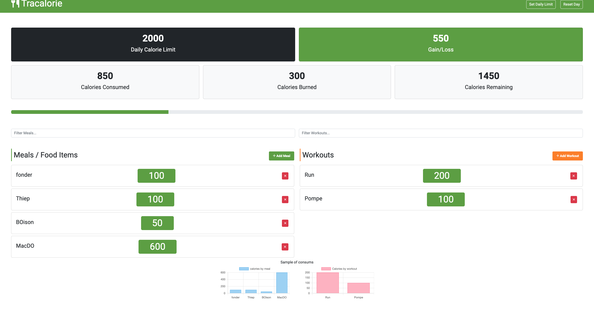

# Calorie Tracker App



## Overview

This repository contains the source code for a Calorie Tracker application built using HTML, SCSS, CSS, and JavaScript. The application helps users monitor their daily calorie intake and manage their dietary habits.

## Features

- **Calorie Input:** Users can enter the consumed food items along with their respective calorie counts.
- **Daily Overview:** Provides a summary of total calories consumed during the day.
- **Data Persistence:** Utilizes local storage to save entered data, ensuring data persistence between sessions.
- **Data Visualization:** Visual representation of calorie intake using charts or graphs.
- **User-Friendly Interface:** Simple and intuitive design for ease of use.

## Tools & Technologies Used

- **HTML:** Structure and layout of the web application.
- **SCSS & CSS:** Styling and design of the user interface.
- **JavaScript:** Functionalities, interactivity, and data management within the application.
- **Local Storage:** Storing user data for persistence.
- **Webpack:** A pre-configured setup for bundling, minification, and asset management.
- **Babel:** Allows writing modern JavaScript for compatibility with various browsers.
- **Development Server:** Integrated server for live reloading and efficient development.
- **CSS Preprocessing:** Support for CSS preprocessing using Sass, Less, or other loaders.
- **Optimized Build:** Ready for production with optimized and minified assets.
- **Asset Management:** Load and manage images, fonts, and other assets effortlessly.

## Getting Started

To start using this combined repository:

1. Clone the repository: `git clone git@github.com:MdialloC19/Tracalorie.git`
2. Install dependencies: `npm install`
3. Once the dependencies are installed, you can use the following npm scripts:
   - `npm run build`: Builds the project using Webpack for production.
   - `npm run dev`: Starts the development server with hot reloading enabled.
4. Visit [http://localhost:3000](http://localhost:3000) in your browser to view the Calorie Tracker application.

## How to Use

1. Clone the repository to your local machine.
2. Open `index.html` in your preferred web browser.
3. Start adding food items along with their calorie counts.
4. Monitor your daily calorie intake and manage your dietary habits accordingly.

## Future Improvements

- Incorporate additional nutritional information for food items.
- Implement user authentication for personalized tracking.
- Enhance data visualization with more comprehensive charts or graphs.
- Create a mobile-responsive version for accessibility across devices.

## Credits

- The application utilizes [Chart.js](https://www.chartjs.org/) for data visualization.

```
calorie-tracker-webpack/
│
├── README.md
├── favicon.ico
├── package-lock.json
├── package.json
├── project_diagram.png
├── src/
│   ├── Item.js
│   ├── Storage.js
│   ├── Tracker.js
│   ├── app.js
│   ├── css/
│   │   ├── bootstrap.css
│   │   └── style.css
│   ├── index.html
│   └── webfonts/
└── webpack.config.js

```

- **src:** Contains the source files for the project.
- **dist:** Output folder where the bundled and optimized code is generated by Webpack.

## Contributions

Contributions are welcome! Feel free to fork the repository and submit pull requests for any enhancements or bug fixes.

## License

This project is licensed under the [MIT License](LICENSE).
